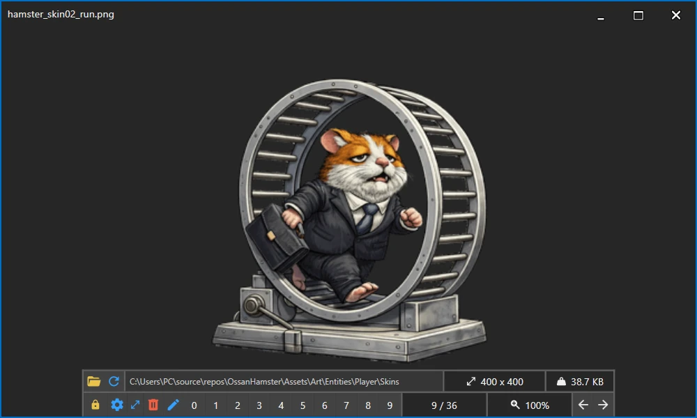

# StswGallery

**StswGallery** is a lightweight Windows gallery viewer for browsing images and media files from a selected directory. It is designed for fast keyboard-driven navigation, quick file sorting, and simple image operations without opening a heavy photo manager.



## Features

* Browse all supported files from a selected directory.
* Open the app directly with a file path and continue browsing from that file's folder.
* Navigate with buttons or keyboard shortcuts.
* Jump to the first, last, previous, next, or a random file.
* View file size, image dimensions, current zoom level, and directory path.
* Zoom and pan images using the built-in zoom viewer.
* Rotate or flip supported image files.
* Remove files safely by moving them to the Recycle Bin.
* Refresh the current directory manually or automatically.
* Use static image display mode or dynamic media display mode.
* Configure number shortcuts from `0` to `9` for quick actions.
* Customize application keyboard shortcuts from the settings panel.

## Supported files

### Images

`bmp`, `dib`, `gif`, `ico`, `jpe`, `jfif`, `jpeg`, `jpg`, `png`, `tif`, `tiff`, `webp`

### Media

Audio and video files such as:

`aac`, `aiff`, `flac`, `m4a`, `mid`, `midi`, `mp3`, `oga`, `ogg`, `opus`, `wav`, `wma`, `3g2`, `3gp`, `avi`, `m2ts`, `m4v`, `mkv`, `mov`, `mp4`, `mpeg`, `mpg`, `ogv`, `ts`, `webm`, `wmv`

Media playback depends on the Windows media stack and available codecs.

## Default shortcuts

| Action            | Default key |
| ----------------- | ----------- |
| Previous file     | `Left`      |
| Next file         | `Right`     |
| First file        | `Home`      |
| Last file         | `End`       |
| Random file       | `Z`         |
| Rotate left       | `Q`         |
| Rotate right      | `E`         |
| Refresh directory | `F5`        |
| Select directory  | `F9`        |
| Remove file       | `Delete`    |

Number keys `0`-`9` can be configured separately as quick shortcuts.

## Number shortcuts

Each number shortcut can be configured as one of the following actions:

| Type        | Description                                             |
| ----------- | ------------------------------------------------------- |
| `None`      | The key does nothing.                                   |
| `Move to`   | Moves the current file to the configured directory.     |
| `Open with` | Opens the current file with the configured application. |

This makes it easy to sort files quickly, for example by assigning folders to keys `1`, `2`, and `3`, then moving the currently displayed file with a single key press.

## Display modes

StswGallery can work in two display modes:

| Mode    | Description                                                                |
| ------- | -------------------------------------------------------------------------- |
| Static  | Uses the image viewer for regular image browsing.                          |
| Dynamic | Uses the media player view, useful for animated or media-oriented preview. |

The settings panel also includes **Allow image upscaling**. When disabled, smaller images are not enlarged beyond their original size. When enabled, images can be stretched up to fit the available window area.

## Configuration

Settings are stored in `appsettings.json` next to the application executable. The file contains:

* application keyboard shortcuts,
* number shortcut definitions,
* image upscaling preference.

You can edit these settings from the built-in configuration panel or directly in the JSON file.

## Getting started

### Run from source

Requirements:

* Windows
* .NET 8 SDK

Clone the repository and run:

```bash
dotnet restore
dotnet run --project StswGallery.csproj
```

### Build release version

```bash
dotnet publish StswGallery.csproj -c Release -r win-x64 --self-contained false
```

The published files will be created in the `bin/Release` directory.

## Tech stack

* C#
* WPF
* .NET 8
* StswExpress.Wpf

## Project status

StswGallery is a small personal desktop utility focused on fast local file browsing and lightweight gallery management.